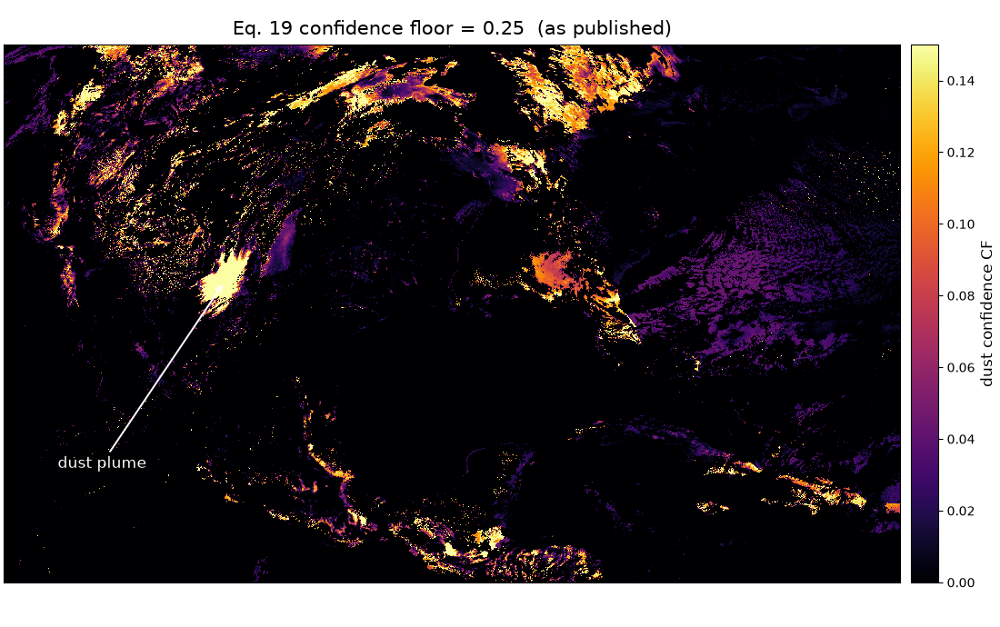
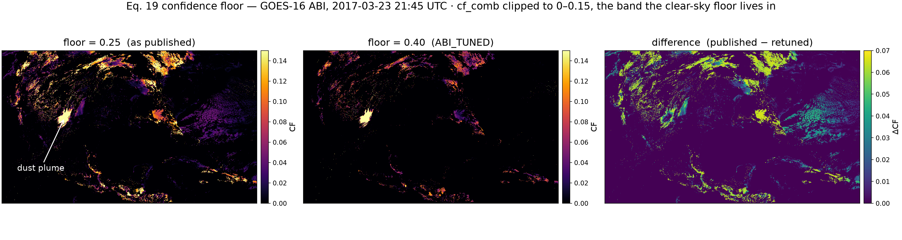
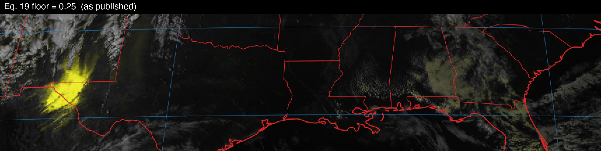

# Deviations from the published algorithm

Everything here is deliberate, unit-tested, and recorded in the module
docstrings next to the code. **Check this page and the erratum before
"fixing" any of it.**

The baseline is Miller et al. (2017),
[doi:10.1002/2017JD027365](https://doi.org/10.1002/2017JD027365), **as amended
by the erratum published 26 February 2020**.

---

## 1. The erratum, not the original print run

Equations 7, 21–22 and 24–25 are implemented in their **erratum** form. If you
are reading the 2017 PDF, these five will not match the code — that is the
erratum, not a deviation introduced here.

## 2. Corrections to equations the erratum does not cover

Three printed equations remain inconsistent with the paper's own prose and
figures after the erratum. Each is implemented per the prose, with the
reasoning below.

### Eq. 4 (CM2) — magnitude reversed

```
CM2 = 1 - N(BT10.4 - BT6.2; 0, 25)      # deep convection → 1, clear → 0
```

As printed, clear sky — where the 10.4/6.2 µm split runs 25–55 K — yields
CM2 ≈ 1, which saturates the cloud mask everywhere and degenerates the whole
algorithm. The prose describes CM2 as behaving "in a similar fashion" to the
already-reversed Eq. 1, and Figure 3c shows the reversed sense.

### Eq. 11 (CM_day) — CM3, not CM4

```
CM_day = (CM1 + CM2 + CM3) * (1 - max(R1, R2_day))
```

The printed equation references CM4, but CM4 is the 3.9 µm test, which the
paper itself defines as night-only. CM3 is the intended term.

### Eq. 15 (DT3) — magnitude reversed

```
DT3 = clip(((T_MERRA - S) - BT10.4) / depth, 0, 1)
```

with the surface shift `S` = −10 K (land) / +5 K (ocean) applied as printed,
and `depth` = 50 K. The prose is explicit that "observations that are
relatively cold compared to MERRA produce high value for DT3", which the
printed equation does not do.

## 3. Ancillary data substitution

**Surface emissivity: CAMEL in place of UWBF.** The paper specifies the
monthly UW Baseline Fit (UWBF, CIMSS) 0.05° climatology, which requires a
separate CIMSS registration. The default here is its successor **CAMEL**
(`CAM5K30EM`, NASA LP DAAC), reachable with the same Earthdata credentials as
MERRA-2. Both carry an emissivity cube on labelled hinge-point wavelengths and
are interpolated linearly in wavelength, as the paper implies;
`io.emissivity.load_band_emissivity` accepts either file.

## 4. Optional ABI retune (not the default)

`constants.ABI_TUNED` raises the **Eq. 19 lower bound from 0.25 to 0.40**. It
is opt-in — `DEFAULTS` remains the paper's values.

Why it exists: with this ancillary stack (ABI + MERRA-2 + CAMEL), DT3 carries a
0.2–0.5 clear-sky floor over land, because MERRA-2 skin temperature runs warmer
than BT10.4 and the −10 K land shift adds to it. That floor leaks through
low-cloud-mask pixels as a faint yellow tint over vegetated and low-cloud
areas.

The images below are **APNG**: they animate in any modern browser and show
their first frame everywhere else. Blinking is the point — the change is a
small shift in a low-amplitude field, and side-by-side panels hide exactly that
kind of difference.



`cf_comb` clipped to 0–0.15, the band the clear-sky floor lives in. The
published floor leaks a speckle of confidence across the whole scene and a haze
over the vegetated southeast; the retune removes most of it. The dust plume is
untouched.



The same two states with their difference. ΔCF never exceeds 0.067 — the whole
effect lives in that narrow band — but it is spread over a large area.



The same change in the **finished imagery**, cropped from the plume east to the
Gulf coast and magnified 2×. Here the two states differ by at most 14/255 per
pixel: the tint being removed sits at CF 0.05–0.10, which Eqs. 27–29 map to a
handful of RGB levels. This is worth knowing before you reproduce it — run both
settings and the output images will look nearly identical, even though the
statistic below moves a lot. The statistic is real; it is just not a visual one.

Reproduce either state with
`python scripts/run_case.py 2017-03-23-swus --tuning paper|abi`.

Sweeping the floor across the three reference cases:

| metric | 0.25 (published) | 0.30 | 0.35 | **0.40** | 0.45 |
|---|---|---|---|---|---|
| 2017-03-23 plume mean CF | 0.476 | 0.468 | 0.460 | **0.452** | 0.445 |
| 2017-03-23 SE-US vegetation, fraction CF > 0.05 | 0.368 | 0.340 | 0.172 | **0.028** | 0.006 |
| 2020-12-23 plume core mean | 0.202 | 0.184 | 0.166 | **0.150** | 0.135 |
| 2020-12-23 plume core p90 | 0.439 | 0.426 | 0.413 | **0.399** | 0.384 |

0.40 is the knee: 92% of the tinted area is gone for a 5% cost on the strong
2017 plume, and the moderate 2020-12-23 core still renders as saturated yellow
(p90 ≈ 0.40 after Eqs. 27–29). 0.45 starts erasing the moderate case.

The paper anticipates "minor retuning" per sensor. **Himawari AHI needs none** —
the published bounds were tuned on AHI and transfer as-is. `ABI_TUNED` is
selectable on AHI but has not been validated there.

---

## What is *not* a deviation

- **The composite background** (`composite.py`) is the paper's own §3.2
  alternative — a ~14-day rolling, cloud-cleared, same-time-of-day composite —
  not an addition. It is offered alongside the semi-analytic background because
  it carries the split-window water-vapour depression that emissivity × Planck
  lacks, which otherwise zeroes DT1/DT2 on transparent winter plumes.
- **Himawari AHI support** is within the paper's scope; the band mapping simply
  differs from ABI.
- **`constants.py` values.** Every calibration bound, offset and weight is
  transcribed from the paper and unit-tested against an independent
  transcription.
