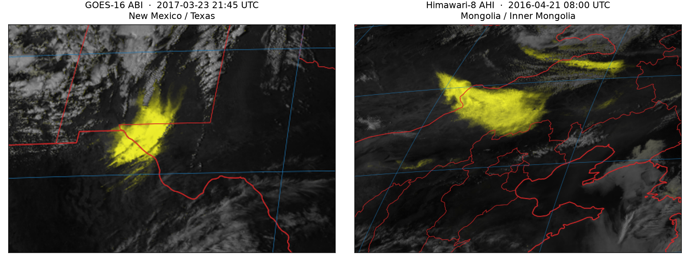

# shachen (沙尘)

Infrared satellite **dust storm detection** in Python — an open implementation
of **DEBRA-Dust**, the Dynamic Enhancement with Background Reduction Algorithm
([Miller et al. 2017](https://doi.org/10.1002/2017JD027365)), for GOES ABI and
Himawari AHI.

*shachen* (沙尘) is Chinese for "sand and dust". The package is a home for
infrared-channel dust algorithms; DEBRA-Dust is the first one.

```{admonition} Erratum, not the original print run
:class: important

All equations follow the erratum published 26 February 2020, not the figures
as originally printed — plus three further corrections documented in
[Deviations](deviations.md). Read that page before changing any constant or
sign convention.
```



Dust is the yellow modulation; everything else stays in greyscale infrared.

## What it does

DEBRA turns the split-window infrared signal that is specific to *mineral*
dust into a per-pixel confidence field, by comparing each pixel against a
dynamically estimated **clear-sky background** rather than a fixed threshold.
That background is what lets it work over bright, emissivity-heterogeneous
desert surfaces where fixed thresholds produce false alarms.

```
io.satellite.load_scene   L1b → bt_* / refl_* on the 2 km fixed grid (satpy)
        │
        ▼
pipeline.run_debra
├─ geo.regrid_latlon      MERRA-2 / CAMEL → satellite grid
├─ solar                  per-pixel solar zenith (day / twilight / night mix)
├─ background             scheme A: CAMEL emissivity × Planck(MERRA-2 skin T)
│    or composite         scheme B: 14-day cloud-cleared same-hour composite
├─ cloudmask              Eqs. 1–12, including the dust restoral term
├─ dust_tests             DT1–DT3, Eqs. 13–15, normalised per-pixel
├─ confidence             Eqs. 16–22 → cf_comb
├─ imagery                Eqs. 23–29, CF-modulated RGB
└─ render                 georeferenced PNG with coastlines (cartopy)
```

## Quick start

```sh
pip install shachen
```

```python
import shachen

result = shachen.run_debra(scene, skin_temperature=merra_ts, emissivity=camel)
result["cf_comb"]  # combined dust confidence, 0–1
```

The [User guide](guide.md) covers what `scene` must contain, the two
background schemes, and how to get from a confidence field to a rendered PNG.
[Equations](equations.md) sets out all 29 of the paper's equations in the form
this package implements them, each linked to the function that runs it, and the
[API reference](api/index.md) documents every module.

```{toctree}
:maxdepth: 2
:hidden:

guide
equations
api/index
deviations
patent-history
```

```{toctree}
:caption: Project
:hidden:

GitHub <https://github.com/ringsaturn/shachen>
Paper (doi:10.1002/2017JD027365) <https://doi.org/10.1002/2017JD027365>
```

## Citation

If you use this software, please cite the original algorithm:

> Miller, S. D., Bankert, R. L., Grasso, L. D., Lindsey, D. T., Kuciauskas,
> A. P., & Combs, C. L. (2017). A dynamic enhancement with background reduction
> algorithm: Overview and application to satellite-based dust storm detection.
> *Journal of Geophysical Research: Atmospheres*, 122, 12,938–12,959.
> <https://doi.org/10.1002/2017JD027365>

and, for the implementation, the metadata in `CITATION.cff`.

This is an independent implementation. It is not produced, endorsed, or
verified by the paper's authors, by CIRA, or by NOAA.
